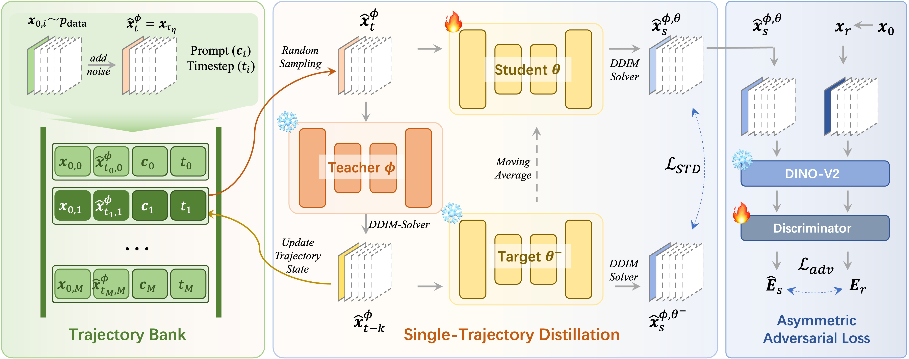
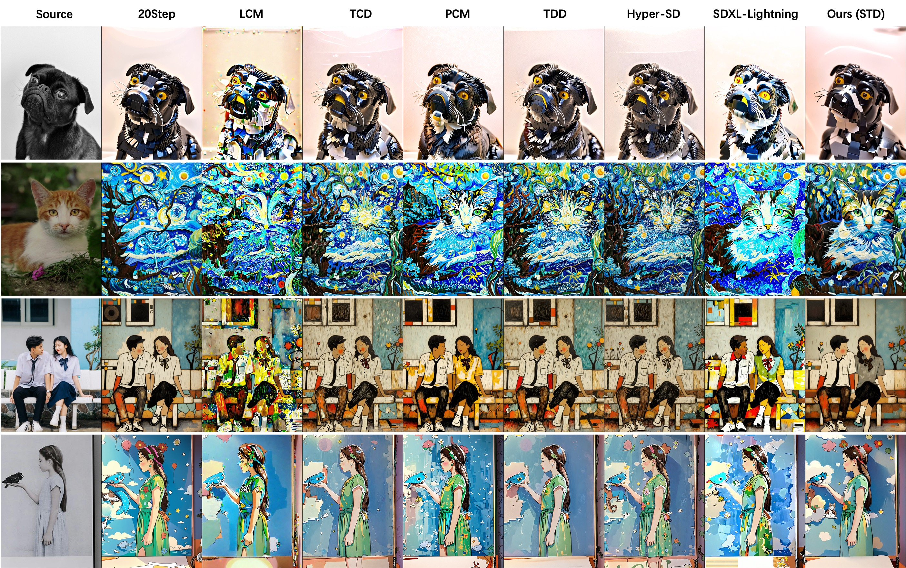
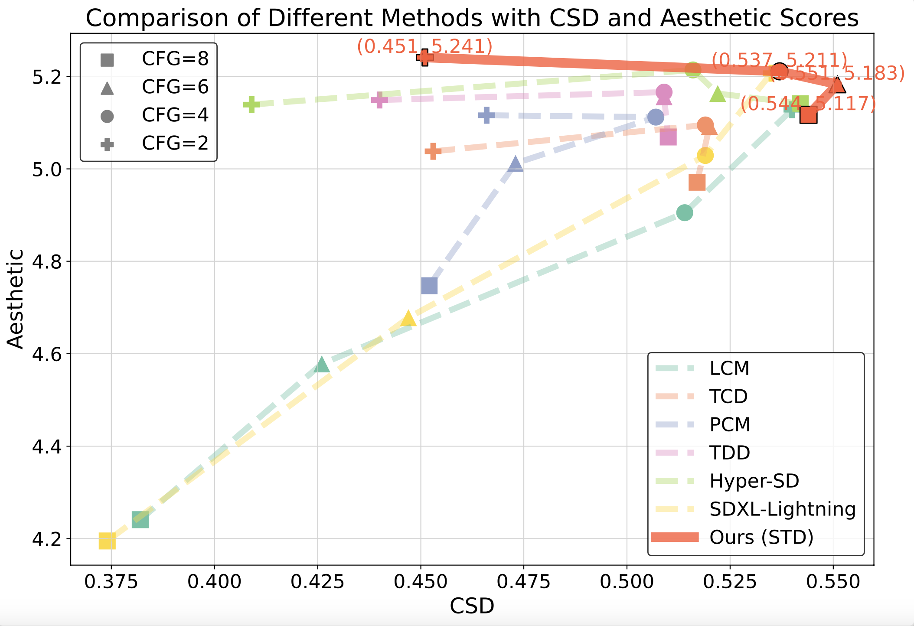

# Single Trajectory Distillation for Accelerating Image and Video Style Transfer

[](https://arxiv.org/abs/2412.18945)
[](https://huggingface.co/SecondComming/Single-Trajectory-Distillation)
[](https://github.com/dynamic-X-LAB/Single-Trajectory-Distillation)
[](https://single-trajectory-distillation.github.io/)

**Authors**: Sijie Xu<sup>1</sup>, Runqi Wang<sup>1,2</sup>, Wei Zhu<sup>1</sup>, Dejia Song<sup>1</sup>, Nemo Chen<sup>1</sup>, Xu Tang<sup>1</sup>, Yao Hu<sup>1</sup>  
**Affiliations**: <sup>1</sup>Xiaohongshu, <sup>2</sup>ShanghaiTech University

## 📢 News
- **[2025.02.11]** 🔥 [Source code released](https://github.com/dynamic-X-LAB/Single-Trajectory-Distillation)
- **[2025.02.10]** 🔥 [Pretrained models available on Hugging Face](https://huggingface.co/SecondComming/Single-Trajectory-Distillation)
- **[2024.12.31]** 🔥 [Paper published on arXiv](https://arxiv.org/abs/2412.18945)

## 📖 Abstract
Diffusion-based stylization methods typically denoise from specific partial noise states for image/video tasks. This multi-step process faces computational challenges that hinder real-world applications. While consistency models through trajectory distillation offer acceleration potential, existing approaches only enforce initial-step alignment between student and imperfect teacher models. We propose **Single Trajectory Distillation (STD)** with three key innovations:
1. **Single Trajectory Distillation Method** starting from a specific partial noise state
2. **Trajectory Bank** for efficient state management
3. **Asymmetric Adversarial Loss** based on DINO-v2 for quality enhancement

Extensive experiments demonstrate our method surpasses existing acceleration models (LCM, TCD, PCM, etc.) in style similarity and aesthetic metrics.

## 🎯 Key Features
- **8-4 step** high-quality stylization
- Unified framework for **image & video** processin
- **Plug-and-play** integration with existing SDXL pipelines

## 🖼️ Visual Results
### Method Overview

*Architecture diagram showing (Left) Trajectory Bank management, (Center) Single-trajectory distillation framework, (Right) Asymmetric adversarial loss component*

### Qualitative Comparison

*Visual comparison with LCM, TCD, PCM, and other baselines at NFE=8 (CFG=6)*

### Metric Analysis
<div style="text-align: center;">
  
</div>

*Performance under different CFG values (2-8). Our method (red line) achieves optimal style-content balance.*

## 🚀 Quick Start

### Installation
```bash
pip install -r requirements.txt
```
### Inference Demo (Image-to-Image)
```python
# !pip install opencv-python
import torch
import diffusers
from diffusers import StableDiffusionXLImg2ImgPipeline
from diffusers.schedulers.scheduling_tcd import TCDScheduler
from PIL import Image
 
device = "cuda"
std_lora_path = "weights/std/std_sdxl_i2i_eta0.75.safetensors"
 
pipe = StableDiffusionXLImg2ImgPipeline.from_pretrained("weights/dreamshaper_XL_v21", torch_dtype=torch.float16, variant="fp16").to(device)
 
# load std lora
pipe.scheduler = TCDScheduler.from_config(pipe.scheduler.config, timestep_spacing='leading', steps_offset=1)
pipe.load_lora_weights(std_lora_path, adapter_name="std")
pipe.fuse_lora()
 
# load ipadapter
pipe.load_ip_adapter("h94/IP-Adapter", subfolder="sdxl_models", weight_name='ip-adapter-plus_sdxl_vit-h.bin')
pipe.set_ip_adapter_scale(dict(down=0, mid=0, up=dict(block_0=[0, 1, 0], block_1=0))) # only add on 7th block
 
# inputs
prompt = "Stick figure abstract nostalgic style."
n_prompt = "worst face, NSFW, nudity, nipples, (worst quality, low quality:1.4), blurred, low resolution, pixelated, dull colors, overly simplistic, harsh lighting, lack of detail, poorly composed, dark and gloomy atmosphere, (malformed hands:1.4), (poorly drawn hands:1.4), (mutated fingers:1.4), (extra limbs:1.35), (poorly  drawn face:1.4), missing legs, (extra legs:1.4), missing arms, extra arm, ugly, fat, (close shot:1.1), explicit content, sexual content, pornography, adult content, inappropriate, indecent, obscene, vulgar, suggestive, erotic, lewd, provocative, mature content"
src_img = Image.open("doc/imgs/src_img.jpg").resize((960, 1280))
style_img = Image.open("doc/imgs/style_img.png")
 
image = pipe(
    prompt=prompt,
    negative_prompt=n_prompt,
    num_inference_steps=11, # 8 / 0.75 = 11
    guidance_scale=6,
    strength=0.75,
    image=src_img,
    ip_adapter_image=style_img,
).images[0]
 
image.save("std.png")
```
## 📦 Model Zoo

We provide pretrained models for both image-to-image and video-to-video tasks with different η values. All models are hosted on Hugging Face.

### Image-to-Image Models
| η Value | Model Link |
|---------|------------|
| 0.65    | [std_sdxl_i2i_eta0.65.safetensors](https://huggingface.co/SecondComming/Single-Trajectory-Distillation/resolve/main/std_sdxl_i2i_eta0.65.safetensors) |
| 0.75    | [std_sdxl_i2i_eta0.75.safetensors](https://huggingface.co/SecondComming/Single-Trajectory-Distillation/resolve/main/std_sdxl_i2i_eta0.75.safetensors) |
| 0.85    | [std_sdxl_i2i_eta0.85.safetensors](https://huggingface.co/SecondComming/Single-Trajectory-Distillation/resolve/main/std_sdxl_i2i_eta0.85.safetensors) |
| 0.95    | [std_sdxl_i2i_eta0.95.safetensors](https://huggingface.co/SecondComming/Single-Trajectory-Distillation/resolve/main/std_sdxl_i2i_eta0.95.safetensors) |

### Video-to-Video Models
| η Value | Model Link |
|---------|------------|
| 0.65    | [std_sdxl_v2v_eta0.65.safetensors](https://huggingface.co/SecondComming/Single-Trajectory-Distillation/resolve/main/std_sdxl_v2v_eta0.65.safetensors) |
| 0.75    | [std_sdxl_v2v_eta0.75.safetensors](https://huggingface.co/SecondComming/Single-Trajectory-Distillation/resolve/main/std_sdxl_v2v_eta0.75.safetensors) |
| 0.85    | [std_sdxl_v2v_eta0.85.safetensors](https://huggingface.co/SecondComming/Single-Trajectory-Distillation/resolve/main/std_sdxl_v2v_eta0.85.safetensors) |
| 0.95    | [std_sdxl_v2v_eta0.95.safetensors](https://huggingface.co/SecondComming/Single-Trajectory-Distillation/resolve/main/std_sdxl_v2v_eta0.95.safetensors) |

## 🛠️ Training
### Data Preparation
Download the [Open-Sora-Plan-v1](https://huggingface.co/datasets/LanguageBind/Open-Sora-Plan-v1.0.0) dataset from Hugging Face, which is splitted from [Panda70M](https://github.com/snap-research/Panda-70M).
### Model Architecture
```
weights/
├── dinov2_vits14_pretrain.pth
├── ipadapter/
├── motion_adapter_hsxl/
├── open_clip_pytorch_model.bin
└── sdxl_base1.0/
```
### Training Command
```bash
bash scripts/std_sdxl_i2i.sh
```
# 📚 Citation
```bibtex
@article{xu2024single,
  title={Single Trajectory Distillation for Accelerating Image and Video Style Transfer},
  author={Xu, Sijie and Wang, Runqi and Zhu, Wei and Song, Dejia and Chen, Nemo and Tang, Xu and Hu, Yao},
  journal={arXiv preprint arXiv:2412.18945},
  year={2024}
}
```
# 🙏 Acknowledgement
This work builds upon [MCM](https://github.com/yhZhai/mcm). We thank the open-source community for their valuable contributions.
